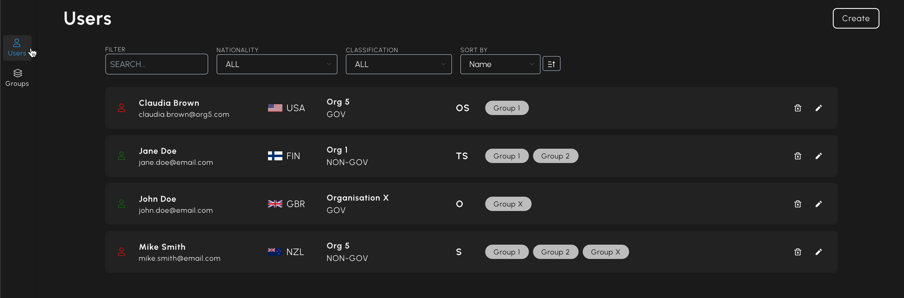
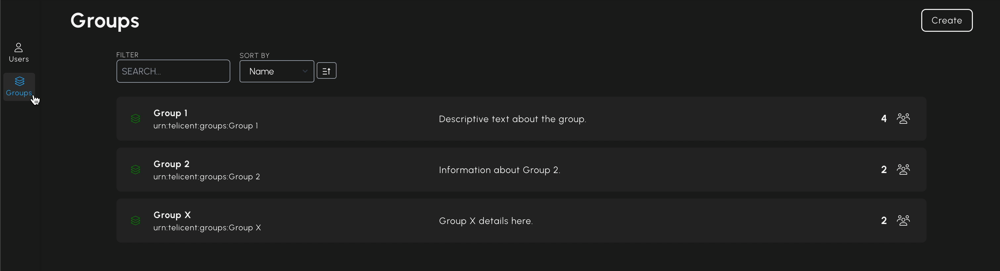

# Telicent Access

❗️ **The purpose of the ACCESS application is to allow testing and demonstration of
Attribute Based Access Control (ABAC) capability within Telicent CORE&copy;. It
should not be used in a production environment**.

[](https://github.com/telicent-oss/telicent-access/actions/workflows/publish.yml)

### Contents

- [Product summary](#product-summary)
- [Background](#background)
  - [User permission attributes](#user-permission-attributes)
  - [Integrating with other Telicent applications](#integrating-with-other-telicent-applications)
- [Getting started](#getting-started)
- [Usage](#usage)
  <!-- - [Users](#users) -->
  - [Groups](#groups)

## Product summary

Telicent Access controls data access within Telicent CORE©. Access is managed in
the **Smart Caches** (both database and API) using Attribute Based Access Control
(ABAC). Data is labelled with security attributes at a granular level, and users
must match these attributes to access information. This is achieved through:

- Registering users on the platform and defining their access permissions.
- Managing access permissions efficiently for multiple users using groups.

## Background

### User permission attributes

User permission attributes determine access to data within Telicent CORE©. This
access control is enforced in the **Smart Caches** (both database and API) using
ABAC. Security labels are applied to data at a granular level, and a user's
attributes must meet these labels to access the information.

ACCESS provide admins the ability to configure users' attributes in line with a
handling model. It also allows admins to specify local groups which permit
extensions to attributes and access. Furthermore, attributes and groups are
retrievable across the platform. The attributes have been created with
reference to both the naming conventions of the data and the user. When using
the ACCESS application, the user attribute name is shown; upon the platform
looking up details about a user, or as part of the authorisation process, the
API will return the data attribute label.

### Integrating with other Telicent applications

When deployed with its basic functionality (SCIM_ENABLED = false), ACCESS is simply
a user entitlements service. User management is done external to CORE by the
enterprise and consequently we need a way to bring the user through from the IdP
to ACCESS to register them within the system. When a user interacts with a "data
focussed" application, such as Telicent GRAPH or Telicent SEARCH, the application
will call an ACCESS endpoint. This endpoint (/whoami) return the user's details.
Under the hood it does a little bit more, if the user doesn't exist, it creates
a skeleton user with no attributes assigned. An administrator is then required
to go in and activate the user, applying the attributes at this point.

ACCESS can be configured to utilise the System for Cross-domain Identity
Management (SCIM) standard for managing user identity information. The goal of
SCIM is to securely automate the exchange of user identities between
applications or systems. In this implementation, an existing or external
identity provider (IdP) is responsible for user management (authentication) and
ACCESS is responsible for user attributes (authorisation).

SCIM helps to manage this relationship and when enabled in ACCESS, functions in
the following way:

- Users are created in an external user management system, which ACCESS
  communicates with via SCIM to obtain a mapped representation of the SCIM users.
- Authentication is handled by the external system.
- User attributes used for authorisation are added and managed by ACCESS.
- Soft delete support - if SCIM tries to delete a user via ACCESS, they are
  instead deactivated and an admin can then fully delete the user in the
  external IdP if required.
- SCIM IdPs can create users, but currently have no oversight or power to
  manage attributes or access. SCIM allows for group configuration, but these
  are not taken into account when it comes to authorisation decisions. Groups
  are instead handled by ACCESS alone.

## Getting started

To get started run the script to setup all the services, in your terminal run

```sh
scripts/dev-docker-setup.sh
```

Once all the Docker services are running, run to gain open the Telicent Access application

```sh
python3 scripts/open-ui.py
```

## Usage

There are two main sets of information displayed in Telicent ACCESS: a list of
users and a list of groups that users can belong to.

<!-- ### Users



Upon running ACCESS, the user list is shown; this can also be accessed by
clicking _Users_ in the left sidebar. It displays all users in
ACCESS (either manually or via SCIM), along with their properties:

- _Active_\
  This icon shows whether the user is active:

  - _Green_ = active
  - _Red_ = inactive

- _Name_\
  Username

- _Email_\
  User's email address

- _Nationality_\
  User's nationality

- _Deployed organisation_\
  Organisation to which the user is assigned

- _Personnel type_\
  User's personnel type:

  - _GOV_ = Government
  - _NON-GOV_ = Non-government

- _Classification_\
  Clearance level possessed by the user:

  - _O_ = Official
  - _OS_ = Official Sensitive
  - _S_ = Secret
  - _TS_ = Top Secret

- _Groups_\
  All groups to which the user is assigned (click _more_ if all are not shown);
  groups are described in more detail in the next section

There are also _Delete_ and _Edit_ functions for each user, as well as a search
by username and email address function, and filters for nationality and
classification.

NB: _Delete_ will remove the user from ACCESS, however, if in the IdP, the user still has the correct groups for accessing CORE, the user will be recreated (when they log on). When this occurs, the user will be recreated as _inactive_ and with no other attributes. -->

### Groups



Groups are used to assign access control to multiple users simultaneously.
Clicking _Groups_ in the left sidebar shows a list of groups with the following
properties:

- _Active_\
  This icon shows whether the group is active:

  - _Green_ = active
  - _Red_ = inactive

- _Name_\
  Group name

- _ID_\
  Group ID

- _Description_\
  Further information about the group

- _User count_\
  Number of users assigned to this group; click this to show a list of the
  usernames in the group

There is also a search by group name function.

Clicking _Create_ allows for the creation of a group with the above properties.

## API

More details on the API and its endpoints can be found in [API.md](./docs/API.md).
